Title: Prerequisites to Coding The PGN Parser Chess
Date: 2020-12-05 10:19
Modified: 2020-12-05 19:29
Category: Python
Tags: programming
Slug: pgn-parser-chess
Authors: Mansi Sharma
Summary: Before trying to parse a pgn file to determine final positions of pieces on Chess Board, let us understand it's mechanism on which it is based.

###What is a PGN file?###

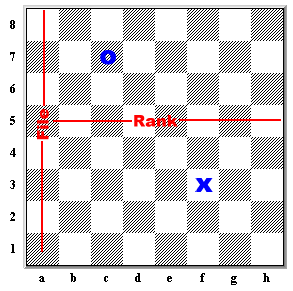

So before we start diving into the code at once first of all let's understand what is a pgn file and what does the different symbols in it mean. Ok, so Portable Game Notation (PGN) is a plain text computer-processible format for recording chess games (both the moves and related data), supported by many chess programs.

The notations the records the moves of both the players one by one. But before the starting of the recording of moves PGN data for archival storage is required to provide seven bracketed fields, referred to as "tags" and together known as the STR (Seven Tag Roster).In export format, the STR tag pairs must appear before any other tag pairs that may appear, and in this order:

1. Event: the name of the tournament or match event.

2. Site: the location of the event. This is in City, Region COUNTRY format, where COUNTRY is the three-letter International Olympic     Committee code for the country. An example is New York City, NY USA.

3. Date: the starting date of the game, in YYYY.MM.DD form. ?? is used for unknown values.

4. Round: the playing round ordinal of the game within the event.

5. White: the player of the white pieces, in Lastname, Firstname format.

6. Black: the player of the black pieces, same format as White.

7. Result: the result of the game. This can only have four possible values: 1-0 (White won), 0-1 (Black won), 1/2-1/2 (Draw), or * (    other, e.g., the game is ongoing).

The movetext describes the actual moves of the game. This includes move number indicators (numbers followed by either one or three periods; one if the next move is White's move, three if the next move is Black's move) and movetext in Standard Algebraic Notation (SAN).

For most moves the SAN consists of the letter abbreviation for the piece, an x if there is a capture, and the two-character algebraic name of the final square the piece moved to. The letter abbreviations are K (king), Q (queen), R (rook), B (bishop), and N (knight). The pawn is given an empty abbreviation in SAN movetext, but in other contexts the abbreviation P is used. The algebraic name of any square is as per usual algebraic chess notation; from white's perspective, the leftmost square closest to white is a1, the rightmost square closest to the white is h1, and the rightmost (from white's perspective) square closest to black side is h8.

In a few cases a more detailed representation is needed to resolve ambiguity; if so, the piece's file letter, numerical rank, or the exact square is inserted after the moving piece's name (in that order of preference). Thus, Nge2 specifies that the knight originally on the g-file moves to e2.

SAN kingside castling is indicated by the sequence O-O; queenside castling is indicated by the sequence O-O-O (note that these are capital Os, not zeroes, contrary to the FIDE standard for notation). Pawn promotions are notated by appending = to the destination square, followed by the piece the pawn is promoted to. For example: e8=Q. If the move is a checking move, + is also appended; if the move is a checkmating move, # is appended instead. For example: e8=Q#.

Comments are inserted by either a ; (a comment that continues to the end of the line) or a { (which continues until a }). Comments do not nest.

According to Forsyth-Edward Notation, the white pieces are represented by capital letters and black pieces are represented by small letters.

###Example###

Here is the PGN format of the 29th game of the 1992 match played in Yugoslavia between Bobby Fischer and Boris Spassky:

    [Event "F/S Return Match"]
    [Site "Belgrade, Serbia JUG"]
    [Date "1992.11.04"]
    [Round "29"]
    [White "Fischer, Robert J."]
    [Black "Spassky, Boris V."]
    [Result "1/2-1/2"]

    1. e4 e5 2. Nf3 Nc6 3. Bb5 a6 {This opening is called the Ruy Lopez.}
    4. Ba4 Nf6 5. O-O Be7 6. Re1 b5 7. Bb3 d6 8. c3 O-O 9. h3 Nb8 10. d4 Nbd7
    11. c4 c6 12. cxb5 axb5 13. Nc3 Bb7 14. Bg5 b4 15. Nb1 h6 16. Bh4 c5 17. dxe5
    Nxe4 18. Bxe7 Qxe7 19. exd6 Qf6 20. Nbd2 Nxd6 21. Nc4 Nxc4 22. Bxc4 Nb6
    23. Ne5 Rae8 24. Bxf7+ Rxf7 25. Nxf7 Rxe1+ 26. Qxe1 Kxf7 27. Qe3 Qg5 28. Qxg5
    hxg5 29. b3 Ke6 30. a3 Kd6 31. axb4 cxb4 32. Ra5 Nd5 33. f3 Bc8 34. Kf2 Bf5
    35. Ra7 g6 36. Ra6+ Kc5 37. Ke1 Nf4 38. g3 Nxh3 39. Kd2 Kb5 40. Rd6 Kc5 41. Ra6
    Nf2 42. g4 Bd3 43. Re6 1/2-1/2

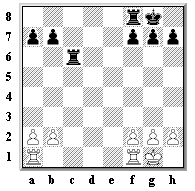&emsp;&emsp;&emsp;
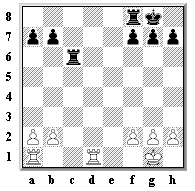

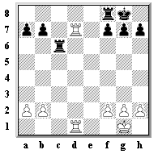&emsp;&emsp;&emsp;
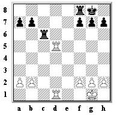

This is how the game above would be written in short algebraic notation:

Moves       |Description
------------|-----------------------------------------------------------------------------
f4 e5	    | The White pawn moves to f4 and the Black pawn to e5.
fxe5 d6	    | The White pawn on the f file takes the pawn on e5. The Black pawn moves to d6.
exd6 Bxd6   | The White pawn on the e file takes the pawn on d6. The Black Bishop takes the pawn on d6.
g3 Qg5	    | The White pawn moves to g3. The Black Queen moves to g5.
Nf3 Qxg3+   | The White Knight moves to f3. The Black Queen takes the pawn on g3 and checks the White King.
hxg3 Bxg3#  | The White pawn on the h file takes the Queen on g3. The Black Bishop takes the pawn on g3 and delivers checkmate.

###Rules Of Chess###

####The Pawn###
&emsp;&emsp;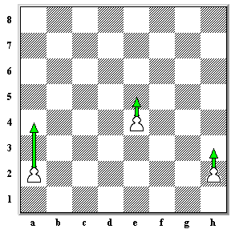&emsp;&emsp;&emsp;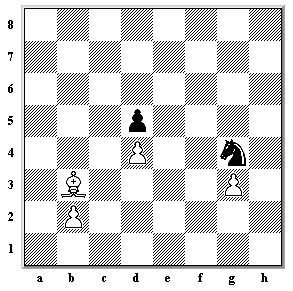

At the beginning of the game each side has 8 pawns. Except on its first move, a pawn may only move one square forward at a time. Pawns can never move backwards. When a pawn makes its very first move it has a choice; it can either move one square or two. However, it moves one square in all following moves.

Although a pawn moves straight forward it captures by talking one square diagonally forward. It can does this by removing the captured piece from the board and replacing it with the pawn.

When a pawn reaches the other end of the board it can be changed for any other piece of its own colour, except the King. This is called promotion. Therefore, a pawn can be promoted to a Queen, a Rook, a Bishop or a Knight.

####The Rook####
&emsp;&emsp;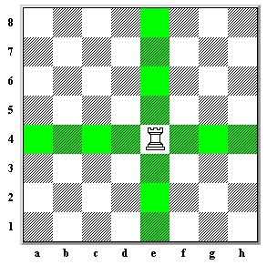&emsp;&emsp;&emsp;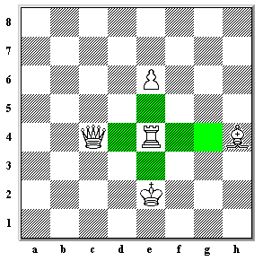

The Rook moves horizontally and vertically any number of squares, forwards or backwards.

If an enemy piece is standing on a square to which the Rook can move, it can be captured. It can do this by removing the enemy piece from the board and placing the Rook on that square instead. The Rook captures the enemy piece and claims the square for itself!

####The Bishop###
&emsp;&emsp;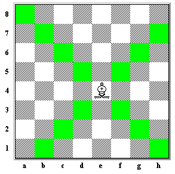&emsp;&emsp;&emsp;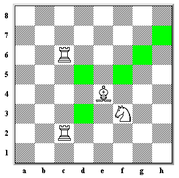

The Bishop moves diagonally any number of squares, forwards or backwards. Each side has two bishops; one bishop moves along the light coloured squares and the other bishop moves along the dark coloured squares.

If an enemy piece is standing on a square to which the Bishop can move, it can be captured. It can do this by removing the enemy piece from the board and placing the Bishop on that square instead.

####The Queen###
&emsp;&emsp;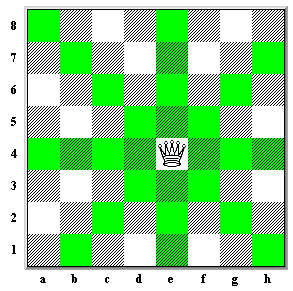&emsp;&emsp;&emsp;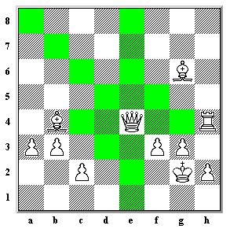

The Queen is the most powerful piece on the board. This is because it can control more squares than any other chessman. It moves straight forward or backwards and diagonally any number of squares.

The moves of a queen are the combined moves of a rook and a bishop.

####The Knight####
&emsp;&emsp;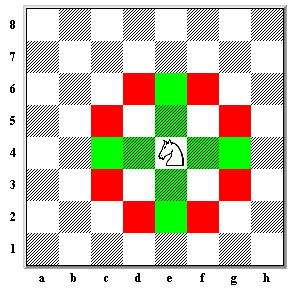&emsp;&emsp;&emsp;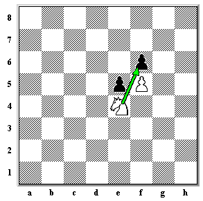

The Knight moves in an L shape in any direction. We can say that it either moves two squares sideways and then one square up or down, or two squares up or down, and then one square sideways. The Knight changes the colour of the square it stands on with each move. Therefore, if it starts off on a light coloured square, when it has finished its move it will land on a dark coloured square.

Just like a real horse, the Knight may jump over pieces.

####The King####
&emsp;&emsp;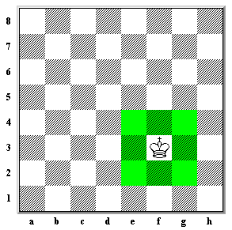&emsp;&emsp;&emsp;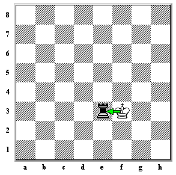

The King is the most important piece on the chessboard. It can never be captured and if it is in danger then it must be made safe immediately. If it is not possible to make the King safe then the game is lost. The King may move one square in any direction.

However, the King must never move on to a square that is being attacked by her opponents pieces.

If a piece is on a square that the King can move to then the King may capture that piece.

####Castling####
&emsp;&emsp;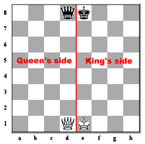&emsp;&emsp;&emsp;

As already mentioned, the King is invaluable. If it is attacked then it must move out of danger immediately and if it cannot be made safe then the game is lost. At the beginning of a chess game there is usually a battle for the centre of the board, therefore it is a good idea to move the King from the action to a safe place in the corner and to move the Rook to the middle of the board where it can take part in the battle. Castling allows you to do this.

The chessboard can be divided vertically into two parts. Looking at the board from White's side, the left side we call the Queen's side and the right-side is the King's side. These terms are important because the King has a choice of which corner he goes to; he can castle to the King's side or to the Queen's side.

When the King castles, he moves two squares to the left or right and the Rook is moved to stand on the opposite side of the King.

If the King castles on the king's side, it is denoted by O-O. And castling on queen's side is denoted by O-O-O.

There are certain conditions which prevent either player from castling:

1. Castling is not possible if either the King or the Rook has moved.

2. All of the squares between the King and the Rook must be empty.

####The En Passant Pawn Capture####
&emsp;&emsp;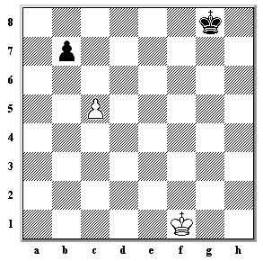&emsp;&emsp;&emsp;

Every pawn, on its first move, has the choice of moving either one or two squares forward. Black may think, "If I move my pawn one square White will capture it so I'll move it two squares." and the position would be both of them standing side by side.

However, White can still take the Black pawn as if it had moved only one square.White removes the black pawn from the board and places the White pawn on the square the Black pawn would have moved to if it had only moved one square forward.

This special way of capturing is called capturing en passant and is abbreviated e.p. En passant is a French expression which means "in passing" The en passant capture must be done immediately after the black pawn advances two squares. If White plays another move she cannot then decide to capture en passant!

<noscript>Please enable JavaScript to view the <a href="https://disqus.com/?ref_noscript">comments powered by Disqus.</a></noscript>

